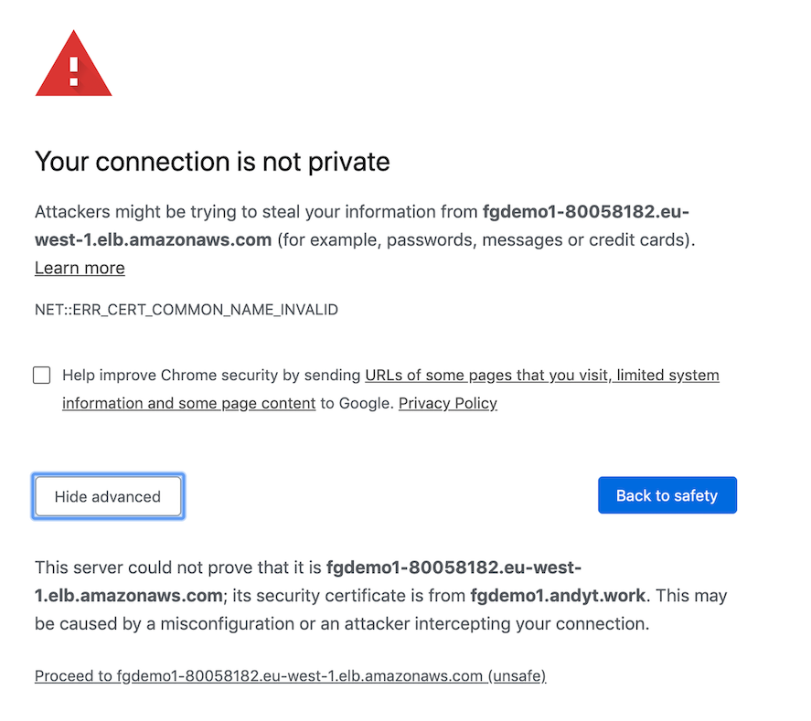

# Fargate CLI demo

## Pre-requisite steps

1. Clone this repo to your machine. 
2. Install the AWS CLI v1.
3. Have your own AWS account and login credentials setup.
4. Download and install the fargate cli:

https://github.com/awslabs/fargatecli/releases

Also recommended - Watch the demo movie:
https://www.youtube.com/watch?v=P6iY6ovhbfc


## Other pre-requistite steps

5. Own your own domain or hosted zone on Amazon Route53.

In the example commands below my domain is **andyt.work** - you will need to change this to your own top level domain/zone.

6. One time setup - create a certificate in AWS Certificate Manager using the fargate cli:

### :star: Tips
:bulb: Be sure to work out of a region that fargate is supported from (eg. eu-west-1)
Always specify the **--region** option when using the fargate cli 

```console
$ fargate certificate request fgdemo1.andyt.work --region eu-west-1
```
```
 ℹ️  Requested certificate for fgdemo1.andyt.work

You must validate ownership of the domain name for the certificate to be issued.

If your domain is hosted using Amazon Route 53, this can be done automatically by running:
    fargate certificate validate fgdemo1.andyt.work

If not, you must manually create the DNS records returned by running:
    fargate certificate info fgdemo1.andyt.work

```

As it says validate the certificate:

```console
$ fargate certificate validate fgdemo1.andyt.work --region eu-west-1
```
```
 ℹ️  [fgdemo1.andyt.work] created validation record
```

Wait about 2-3 minutes and then check the status of your new certificate - it should say Success under STATUS

```console
$ fargate certificate info fgdemo1.andyt.work --region eu-west-1
```
```
Domain Name: fgdemo1.andyt.work
Status: Pending Validation
Type: Amazon Issued
Subject Alternative Names: fgdemo1.andyt.work

Validations

DOMAIN NAME		STATUS	RECORD
fgdemo1.andyt.work	Success	CNAME _00ab335d213368e2d6d1f8749dfd5d37.fgdemo1.andyt.work. -> _774cfa7682a2d0e04b805aed06becf43.vhzmpjdqfx.acm-validations.aws.
```

### :star: With this all done your ready for the main demo:


# Main fargate cli Demo

Get the fargate cli to create a load balancer for your service using your certificate:

```console
$ fargate lb create fgdemo1 --port 443 --certificate fgdemo1.andyt.work --region eu-west-1
```
```
 ℹ️  Created load balancer fgdemo1
 ```

This next command does a few things: 

* Performs a local docker build using the Dockerfile you cloned. 
* Creates a new ECR registry. 
* Tags and pushes the local docker image into the registry. 
* Starts new fargate task/tasks behind the load balancer .

```console
$ fargate service create fgdemo1 --port HTTP:80 --lb fgdemo1 --num 3 --region eu-west-1
```
```
[>] docker login --username AWS --password ******* 566972129213.dkr.ecr.eu-west-1.amazonaws.com/fgdemo1
[>] docker build --rm=false --tag 566972129213.dkr.ecr.eu-west-1.amazonaws.com/fgdemo1:1b243e6 .
Sending build context to Docker daemon  109.6kB
Step 1/13 : FROM alpine
 ---> e7d92cdc71fe
Step 2/13 : RUN apk update && apk add jq curl grep sed openrc nginx --no-cache
 ---> Running in a5604bdc589a
fetch http://dl-cdn.alpinelinux.org/alpine/v3.11/main/x86_64/APKINDEX.tar.gz
fetch http://dl-cdn.alpinelinux.org/alpine/v3.11/community/x86_64/APKINDEX.tar.gz
v3.11.3-75-gbcab687d4f [http://dl-cdn.alpinelinux.org/alpine/v3.11/main]
v3.11.3-74-gdd165531a7 [http://dl-cdn.alpinelinux.org/alpine/v3.11/community]
OK: 11262 distinct packages available
fetch http://dl-cdn.alpinelinux.org/alpine/v3.11/main/x86_64/APKINDEX.tar.gz
fetch http://dl-cdn.alpinelinux.org/alpine/v3.11/community/x86_64/APKINDEX.tar.gz
(1/11) Installing ca-certificates (20191127-r1)
(2/11) Installing nghttp2-libs (1.40.0-r0)
(3/11) Installing libcurl (7.67.0-r0)
(4/11) Installing curl (7.67.0-r0)
(5/11) Installing pcre (8.43-r0)
(6/11) Installing grep (3.3-r0)
(7/11) Installing oniguruma (6.9.4-r0)
(8/11) Installing jq (1.6-r0)
(9/11) Installing nginx (1.16.1-r6)
Executing nginx-1.16.1-r6.pre-install
(10/11) Installing openrc (0.42.1-r2)
Executing openrc-0.42.1-r2.post-install
(11/11) Installing sed (4.7-r0)
Executing busybox-1.31.1-r9.trigger
Executing ca-certificates-20191127-r1.trigger
OK: 12 MiB in 25 packages
Removing intermediate container a5604bdc589a
 ---> 47a29f7d198e
Step 3/13 : RUN mv /etc/nginx/nginx.conf /etc/nginx/nginx.conf.orig
 ---> Running in 54e998cb1f60
Removing intermediate container 54e998cb1f60
 ---> d001e1a48f8d
Step 4/13 : COPY nginx.conf /etc/nginx/nginx.conf
 ---> 218ab6c1c535
Step 5/13 : RUN mkdir -p /run/nginx
 ---> Running in f60f009299b1
Removing intermediate container f60f009299b1
 ---> 15a23717eac6
Step 6/13 : RUN mkdir -p /opt/www
 ---> Running in b05f57e535f3
Removing intermediate container b05f57e535f3
 ---> 7bc9b9ed5fda
Step 7/13 : WORKDIR /opt/www
 ---> Running in 6ec5f209b965
Removing intermediate container 6ec5f209b965
 ---> 6cd86391c337
Step 8/13 : ADD start.sh .
 ---> dffe5324f651
Step 9/13 : RUN chmod +x start.sh
 ---> Running in f3e4cd514f3e
Removing intermediate container f3e4cd514f3e
 ---> 7be0f32d2a16
Step 10/13 : RUN ls -l /opt/www
 ---> Running in b2778da01848
total 4
-rwxr-xr-x    1 root     root          1762 Feb 20 14:00 start.sh
Removing intermediate container b2778da01848
 ---> 86e8b3e0ddcb
Step 11/13 : EXPOSE 22 80
 ---> Running in ae5395cbb4f1
Removing intermediate container ae5395cbb4f1
 ---> 304539b82688
Step 12/13 : ENTRYPOINT ["/bin/sh"]
 ---> Running in e2f123bee50f
Removing intermediate container e2f123bee50f
 ---> 780c3350ad40
Step 13/13 : CMD ["/opt/www/start.sh"]
 ---> Running in 26ba34304014
Removing intermediate container 26ba34304014
 ---> 0820e880ed4d
Successfully built 0820e880ed4d
Successfully tagged 566972129213.dkr.ecr.eu-west-1.amazonaws.com/fgdemo1:1b243e6
[>] docker push 566972129213.dkr.ecr.eu-west-1.amazonaws.com/fgdemo1:1b243e6 .
The push refers to repository [566972129213.dkr.ecr.eu-west-1.amazonaws.com/fgdemo1]
98f774a54358: Pushed 
93cdc8b9e262: Pushed 
78b5db04f09c: Pushed 
c8117e7a7703: Pushed 
1978639e1826: Pushed 
c5c93d4a0311: Pushed 
5216338b40a7: Pushed 
1b243e6: digest: sha256:29ba5ede4a05e03681c15293c84b940ca8692379f277bb5d6e355afb23e6f97a size: 1982
[i] Created service fgdemo1
```

:bulb: **Wow !**


Get some info about the new service
```console
$ fargate service info fgdemo1 --region eu-west-1
```
Study this output - your looking for 3 running services and note the load balancers DNS name

```
Service Name: fgdemo1
Status: 
  Desired: 3
  Running: 3
  Pending: 0
Image: 566972129213.dkr.ecr.eu-west-1.amazonaws.com/fgdemo1:1b243e6
Cpu: 256
Memory: 512
Subnets: subnet-8c6e3dc4, subnet-10dd9d76, subnet-7faf2225
Security Groups: sg-0b2532b833faa985a
Load Balancer: 
  Name: fgdemo1
  DNS Name: fgdemo1-80058182.eu-west-1.elb.amazonaws.com
  Ports: 
    HTTPS:443: 
      Rules: DEFAULT=
      Certificates: fgdemo1.andyt.work

Tasks
ID					IMAGE								STATUS	RUNNING	IP		CPU	MEMORY	DEPLOYMENT	
0da61770-b58c-401d-baf7-b7b5e36116ac	566972129213.dkr.ecr.eu-west-1.amazonaws.com/fgdemo1:1b243e6	running	2m35s	54.246.252.171	256	512	1
101993a6-443f-4ddd-a2dc-648644f8ea1d	566972129213.dkr.ecr.eu-west-1.amazonaws.com/fgdemo1:1b243e6	running	2m35s	54.194.36.159	256	512	1
2bb1b4ea-7882-4e10-953f-bff454e296aa	566972129213.dkr.ecr.eu-west-1.amazonaws.com/fgdemo1:1b243e6	running	2m35s	34.244.249.247	256	512	1

Deployments
ID	IMAGE								STATUS	CREATED				DESIRED	RUNNING	PENDING
1	566972129213.dkr.ecr.eu-west-1.amazonaws.com/fgdemo1:1b243e6	primary	2020-02-20 14:39:53 +0000 UTC	3	3	0

Events
[2020-02-20 14:40:44 +0000 UTC] (service fgdemo1) has reached a steady state.
[2020-02-20 14:40:33 +0000 UTC] (service fgdemo1) registered 1 targets in (target-group arn:aws:elasticloadbalancing:eu-west-1:566972129213:targetgroup/fargate-fgdemo1/bfa933e01f86961b)
[2020-02-20 14:40:22 +0000 UTC] (service fgdemo1) registered 2 targets in (target-group arn:aws:elasticloadbalancing:eu-west-1:566972129213:targetgroup/fargate-fgdemo1/bfa933e01f86961b)
[2020-02-20 14:39:57 +0000 UTC] (service fgdemo1) has started 3 tasks: (task 0da61770-b58c-401d-baf7-b7b5e36116ac) (task 2bb1b4ea-7882-4e10-953f-bff454e296aa) (task 101993a6-443f-4ddd-a2dc-648644f8ea1d).

```

Wait until it says "Running: 3"

Note the dns name of the loadbalancer:

```
$ fargate  service info fgdemo1 --region eu-west-1 | grep DNS
```
```
  DNS Name: fgdemo1-80058182.eu-west-1.elb.amazonaws.com
```

Wait another 60 seconds for the load balancer health checks to clear

Now you can hit the URL:

https://fgdemo1-80058182.eu-west-1.elb.amazonaws.com


You'll need to accept the security exception for the certificate.



*See the [Appendix](#appendix) for how to setup an DNS Alias to fix this error.*

Then you can see the sample web page:


Every time you hit refresh you should see different coloured page
The background colour is set from the last 6 hexidecimal digits of the fargate Task ID:


The script "setup.sh" is responsible for this


## Scale it up and down

``` console
$ fargate service scale fgdemo1 6 --region eu-west-1
```

After a 1-2 minutes you should see 6 different colours when you refresh the bowser :grin:

``` console
$ fargate service scale fgdemo1 2 --region eu-west-1
```

Again after about a minute only 2 colours :-(


# Cleanup

To destroy and cleanup use these commands:

```console
$ fargate service scale fgdemo1 0 --region eu-west-1
$ fargate service destroy fgdemo1 --region eu-west-1
$ fargate lb destroy fgdemo1 --region eu-west-1
```


## Appendix
# <a name="appendix"></a> 

To fix the Certificate error page you can add a step having created the fargate service:

```console
$ fargate lb alias fgdemo1 fgdemo1.andyt.work --region eu-west-1
```

After the DNS records propegate you can visit https://fgdemo1.andyt.work  without any security alerts in the browser as the certificate will then match the service name.


